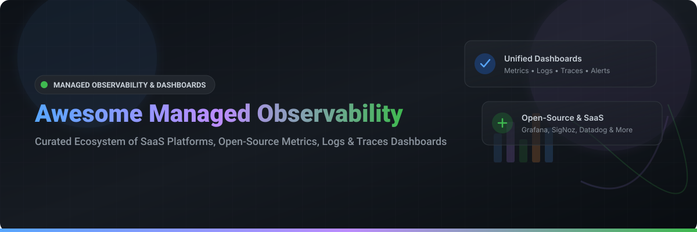

  

# 📊 Awesome Managed Observability Dashboard Platforms & Ecosystem 🚀

  
  
  
  
  
  

> ⚡ **A curated list of top SaaS platforms and Open-Source GitHub projects for Managed Observability Dashboards.**  
> Focused on metrics, logs, distributed tracing, APM, telemetry visualization, unified dashboards, alerting, and cloud-native observability workspaces.

📅 **Last updated: October 2026**

---

## 💡 Overview & SEO Keywords

This repository tracks notable **SaaS observability platforms**, **managed dashboard tools**, and **open-source telemetry projects** for operational intelligence. These solutions provide visual workspaces for exploring metrics, log analytics, distributed traces, and APM telemetry—enabling SREs, DevOps engineers, and developers to monitor system health, troubleshoot microservices, perform root cause analysis, and share real-time operational insights.

* **Key Capabilities:** Real-time metrics visualization, log management, OpenTelemetry (OTel) integration, APM tracing, alerting rules, Prometheus dashboards, Grafana plugin ecosystem, cloud infrastructure monitoring, and synthetic monitoring.

---

## 📑 Table of Contents

- [☁️ SaaS / Hosted Platforms](#-saas--hosted-platforms)
- [🔓 Open-Source GitHub Projects](#-open-source-github-projects)
- [🛠️ Popular Observability Stacks & Architecture Patterns](#-popular-observability-stacks--architecture-patterns)
- [🤝 How to Contribute](#-how-to-contribute)
- [❤️ Support & Sponsorship](#%EF%B8%8F-support--sponsorship)
- [⭐ Star History](#-star-history)
- [⚠️ Disclaimer](#%EF%B8%8F-disclaimer)

---

## ☁️ SaaS / Hosted Platforms

| Product | Description | Pricing | Free Tier |
| --- | --- | --- | --- |
| 🔷 **[Azure Managed Grafana](https://azure.microsoft.com/products/managed-grafana/)** | Microsoft’s fully managed Grafana service integrated with Azure Monitor, Azure data sources, and enterprise authentication. | **Standard Instance**: $6.00 per active Grafana user per month + Azure Monitor data queries ($0.005/1,000 queries). | **30-Day Free Trial**: Free Azure account with $200 credits for 30 days + 12 months of select free services. |
| 🟧 **[Amazon Managed Grafana](https://aws.amazon.com/grafana/)** | AWS-managed Grafana service with native integrations to CloudWatch, X-Ray, Prometheus, and other AWS data sources. | **Editor License**: $9.00/user/month; **Viewer License**: $0.50/user/month + AWS API data transfer costs. | **90-Day Free Trial**: 90 days free for up to 5 Editor user licenses per AWS account. |
| 🟧 **[Grafana Cloud](https://grafana.com/products/cloud/)** | Grafana Labs’ fully managed observability platform providing hosted Grafana, Prometheus-compatible metrics (Mimir), logs (Loki), and traces (Tempo). | **Pro Plan**: Starts at $29.00/month (includes 100k metrics series, 50GB logs, 50GB traces) + usage overages. | **Free Forever Tier**: 10k active metrics series, 50GB logs, 50GB traces, 50GB continuous profiles, up to 3 users. |
| 🐶 **[Datadog Dashboards](https://www.datadoghq.com/product/platform/dashboards/)** | Highly polished, out-of-the-box and custom dashboards within Datadog’s unified observability platform. | **Pro Tier**: $15.00/host/month; **Enterprise Tier**: $23.00/host/month (billed annually) or $18.00/$27.00 on-demand. | **14-Day Free Trial**: 14-day unlimited host free trial (no credit card required). |
| 🟢 **[New Relic One / Dashboards](https://newrelic.com/platform)** | New Relic’s modern observability UI and dashboarding experience for metrics, traces, logs, and full-stack visibility. | **Data Ingest**: $0.30/GB ingested beyond free allowance; **Core User**: $49/month; **Full Platform User**: $99/month (Standard). | **Free Forever Tier**: 100 GB/month data ingestion free, 1 full-platform user, unlimited basic users. |
| 🦅 **[Dynatrace Dashboards](https://www.dynatrace.com/)** | AI-powered observability dashboards with automatic dependency mapping, Davis AI insights, and enterprise-scale visualization. | **Full-Stack Monitoring**: $0.08/hour per 8 GiB host (~$58/month); **Infrastructure Monitoring**: $0.04/hour per host (~$29/month). | **15-Day Free Trial**: 15-day trial with 1,000 Davis credit units included. |
| 📊 **[Klipfolio](https://www.klipfolio.com/)** | Business-oriented dashboard and reporting platform focused on KPIs, metrics consolidation, and non-technical users. | **Go Plan**: $90.00/month; **Pro Plan**: $225.00/month; **Business Plan**: $800.00/month (billed annually). | **Free Forever Tier**: Up to 2 metric dashboards, 4 users, 4-hour data update frequency. |
| 🦎 **[Geckoboard](https://www.geckoboard.com/)** | Simple, TV-friendly dashboard tool designed for sharing real-time business and operational metrics across teams. | **Essential Plan**: $39.00/month (1 dashboard, 5 users); **Pro Plan**: $79.00/month; **Scale Plan**: $159.00/month. | **14-Day Free Trial**: 14-day trial with full access to all features (no credit card required). |
| ⏹️ **[SquaredUp](https://squaredup.com/)** | Dashboarding platform with strong integrations for IT operations, cloud, and business metrics visualization. | **Pro Plan**: $40.00/month for up to 10 users & unlimited dashboards; **Enterprise**: Custom quotes. | **Free Forever Tier**: Free forever for up to 3 users and 3 dashboards with 60+ data source plugins. |
| 🚀 **[SigNoz (Cloud)](https://signoz.io/)** | Managed offering of the open-source SigNoz observability platform, providing dashboards for metrics, traces, and logs. | **Pay-As-You-Go**: $0.10/GB logs & traces ingested, $0.10 per 1M metric samples ingested. | **30-Day Free Trial**: 30-day trial with $200 in free usage credits + 10 GB/month forever free allowance. |

---

## 🔓 Open-Source GitHub Projects

Sorted by GitHub Stars (descending):

1. 💻 **[Netdata](https://github.com/netdata/netdata)**   
   Real-time performance and health monitoring platform for infrastructure, metrics, and low-latency system dashboards.

2. 📊 **[Grafana](https://github.com/grafana/grafana)**   
   The leading open-source observability and visualization platform—supports metrics, logs, traces, and a vast ecosystem of data source plugins.

3. 📈 **[Apache Superset](https://github.com/apache/superset)**   
   Modern, enterprise-ready data exploration and visualization platform often used for business and operational metrics dashboards.

4. 🟧 **[Prometheus](https://github.com/prometheus/prometheus)**   
   Core Cloud Native Computing Foundation (CNCF) metrics collection, time-series database, and alerting stack, typically paired with Grafana.

5. 🔍 **[Glances](https://github.com/nicolargo/glances)**   
   An open-source cross-platform system monitoring tool with a web-based dashboard and CLI.

6. 🚀 **[SigNoz](https://github.com/SigNoz/signoz)**   
   Open-source observability platform providing a unified UI for metrics, traces, and logs built natively on OpenTelemetry and ClickHouse.

7. 🪵 **[Grafana Loki](https://github.com/grafana/loki)**   
   Like Prometheus, but for logs—horizontally-scalable, highly-available, multi-tenant log aggregation system designed for Grafana visualization.

8. 🎯 **[Jaeger](https://github.com/jaegertracing/jaeger)**   
   CNCF open-source, end-to-end distributed tracing system for monitoring microservices architecture and root-cause analysis UI.

9. ⚡ **[Vector](https://github.com/vectordotdev/vector)**   
   High-performance observability data pipeline for collecting, transforming, and routing all metrics, logs, and trace telemetry.

10. 🔎 **[Elastic Kibana](https://github.com/elastic/kibana)**   
    Visualization and exploration UI for Elasticsearch, widely used for log analysis, SIEM security, and metrics dashboards.

11. 🚀 **[VictoriaMetrics](https://github.com/VictoriaMetrics/VictoriaMetrics)**   
    Fast, cost-effective, and scalable time series database and monitoring solution compatible with Prometheus queries and dashboards.

12. ⚡ **[Thanos](https://github.com/thanos-io/thanos)**   
    Highly available Prometheus setup with long-term storage capabilities and global querying across multiple clusters.

13. 🔥 **[Pyroscope](https://github.com/grafana/pyroscope)**   
    Continuous profiling platform integrated with Grafana to pinpoint CPU, memory, and code-level performance bottlenecks.

14. 🩸 **[Fluent Bit](https://github.com/fluent/fluent-bit)**   
    Fast and lightweight telemetry agent for logs, metrics, and trace ingestion into open observability dashboards.

15. 📡 **[OpenTelemetry Collector](https://github.com/open-telemetry/opentelemetry-collector)**   
    Vendor-agnostic telemetry proxy for receiving, processing, and exporting OpenTelemetry data to any dashboarding tool.

16. 🏛️ **[Cortex](https://github.com/cortexproject/cortex)**   
    Horizontally scalable, highly available, multi-tenant Prometheus time series database service.

17. ⏱️ **[Grafana Tempo](https://github.com/grafana/tempo)**   
    Easy-to-use, high-scale, cost-effective distributed tracing backend deeply integrated with Grafana dashboards.

18. 🎯 **[Grafana Mimir](https://github.com/grafana/mimir)**   
    Open-source, horizontally scalable time-series database for long-term Prometheus metrics storage.

19. 🎯 **[Perses](https://github.com/perses/perses)**   
    Open-source, gitops-native dashboard tool focused on Prometheus and cloud-native observability ecosystem.

20. 📂 **[OpenSearch Dashboards](https://github.com/opensearch-project/OpenSearch-Dashboards)**   
    Open-source visualization and exploration interface for OpenSearch log analytics and security trace search.

---

## 🛠️ Popular Observability Stacks & Architecture Patterns

* **The LGTM Stack:** Deploying **Grafana** + **Prometheus/Mimir** (Metrics) + **Loki** (Logs) + **Tempo** (Traces) provides a comprehensive, 100% open-source cloud-native observability stack.
* **All-in-One APM:** **SigNoz** offers a single UI experience built on OpenTelemetry standards and ClickHouse column-store engine.
* **Search & Log-Centric:** **OpenSearch Dashboards** or **Kibana** when log search, SIEM, and unstructured text analytics take priority.
* **Managed vs Self-Hosted:** Managed Grafana (AWS/Azure/Grafana Cloud) and commercial SaaS (Datadog/New Relic/Dynatrace) reduce maintenance burden while self-hosting provides ultimate data privacy and cost optimization.

---

## 🤝 How to Contribute

1. Fork the repository on GitHub.
2. Edit `README.md` following the standard table or list format.
3. Ensure to include product name, official URL, star badge (if open-source), and concise description.
4. Submit a Pull Request with a clear title and description.

If you find this collection helpful, please **Star** ⭐ the repository to support the project!

---

## ❤️ Support & Sponsorship

If you find this curated list valuable for your team or project, please consider supporting the project:

* ⭐ **Star the repo:** Show your appreciation and help others discover this resource.
* 🔀 **Fork & Share:** Spread the word across your team, platform engineering groups, and social networks!
* ☕ **Sponsor / Buy Me a Coffee:** Support ongoing maintenance, updates, and ecosystem research via the [GitHub Sponsor Dashboard](https://github.com/sponsors/ishandutta2007).

---

## 📈 Star History

---

## ⚠️ Disclaimer

* This repository is a **community-curated list** — provided for informational and educational purposes.
* Observability tools process sensitive infrastructure, user telemetry, and log payloads. Ensure proper security, authentication, and retention policies are enforced when deploying self-hosted or SaaS observability solutions.

---

  <b>Made with ❤️ for SREs, DevOps, Platform Engineers, and System Architects.</b>

# Awesome-Managed-Observability-Dashboard

Let me search for open-source observability dashboards and Grafana alternatives.
